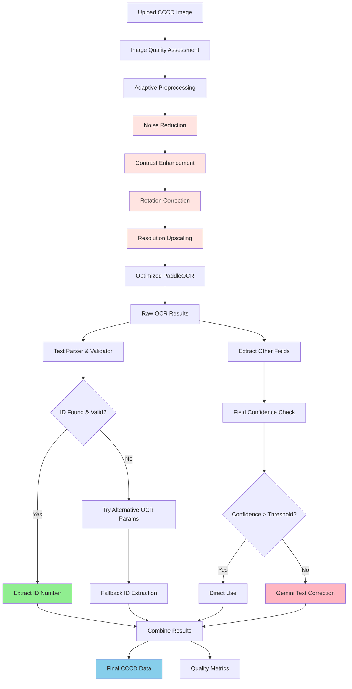

# Phase 1 Enhanced Plan: PaddleOCR + Gemini Integration

## 🎯 Mục Tiêu Phase 1
1. **Tối ưu Image Preprocessing** để cải thiện chất lượng đầu vào cho OCR
2. **Nâng cao PaddleOCR Performance** với custom parameters cho thẻ CCCD
3. **Tạo ID Extraction Module** với high accuracy cho số căn cước
4. **Tích hợp Gemini API** để chỉnh sửa chính tả các field khác
5. **Xây dựng Unified Pipeline** với error handling và monitoring

## 🏗️ Enhanced Architecture



## 📋 Detailed Implementation Plan

### **Phase 1.1: Advanced Image Preprocessing (Week 1)**

#### **1. Image Quality Assessment Module**
```python
# src/id_card_service/processors/image_analyzer.py
class ImageQualityAnalyzer:
    def assess_quality(self, image: np.ndarray) -> dict:
        """Đánh giá chất lượng ảnh và đề xuất preprocessing steps"""
        return {
            'blur_score': float,      # Độ mờ (0-1)
            'brightness': float,      # Độ sáng (-1 to 1)  
            'contrast': float,        # Độ tương phản (0-1)
            'noise_level': float,     # Mức nhiễu (0-1)
            'rotation_angle': float,  # Góc xoay cần sửa
            'resolution_quality': str, # 'low', 'medium', 'high'
            'preprocessing_needed': List[str]  # ['denoise', 'enhance_contrast', ...]
        }
```

#### **2. Adaptive Preprocessing Pipeline**
```python
# src/id_card_service/processors/image_preprocessor.py
class AdaptiveImagePreprocessor:
    def __init__(self):
        self.steps = {
            'denoise': self._apply_denoising,
            'enhance_contrast': self._enhance_contrast,
            'correct_rotation': self._correct_rotation,
            'upscale': self._upscale_image,
            'sharpen': self._apply_sharpening,
            'normalize': self._normalize_image
        }
    
    def process(self, image: np.ndarray, quality_assessment: dict) -> dict:
        """Áp dụng preprocessing steps dựa trên quality assessment"""
        processed_image = image.copy()
        applied_steps = []
        
        for step in quality_assessment['preprocessing_needed']:
            if step in self.steps:
                processed_image = self.steps[step](processed_image, quality_assessment)
                applied_steps.append(step)
        
        return {
            'processed_image': processed_image,
            'applied_steps': applied_steps,
            'quality_improvement': self._calculate_improvement(image, processed_image)
        }
```

#### **3. Specific Preprocessing Techniques**

**Noise Reduction:**
```python
def _apply_denoising(self, image: np.ndarray, quality_info: dict) -> np.ndarray:
    """Áp dụng denoising dựa trên noise level"""
    noise_level = quality_info['noise_level']
    
    if noise_level > 0.7:
        # High noise - use Non-local Means Denoising
        return cv2.fastNlMeansDenoising(image, None, 10, 7, 21)
    elif noise_level > 0.4:
        # Medium noise - use Gaussian blur
        return cv2.GaussianBlur(image, (3, 3), 0)
    else:
        # Low noise - minimal processing
        return cv2.bilateralFilter(image, 9, 75, 75)
```

**Contrast Enhancement:**
```python
def _enhance_contrast(self, image: np.ndarray, quality_info: dict) -> np.ndarray:
    """Adaptive contrast enhancement"""
    contrast_level = quality_info['contrast']
    
    if contrast_level < 0.3:
        # Low contrast - use CLAHE
        clahe = cv2.createCLAHE(clipLimit=3.0, tileGridSize=(8,8))
        if len(image.shape) == 3:
            lab = cv2.cvtColor(image, cv2.COLOR_RGB2LAB)
            lab[:,:,0] = clahe.apply(lab[:,:,0])
            return cv2.cvtColor(lab, cv2.COLOR_LAB2RGB)
        else:
            return clahe.apply(image)
    elif contrast_level < 0.6:
        # Medium contrast - histogram equalization
        return cv2.equalizeHist(image)
    else:
        # Good contrast - minimal adjustment
        return cv2.convertScaleAbs(image, alpha=1.1, beta=10)
```

**Rotation Correction:**
```python
def _correct_rotation(self, image: np.ndarray, quality_info: dict) -> np.ndarray:
    """Auto-correct rotation using text line detection"""
    angle = quality_info['rotation_angle']
    
    if abs(angle) > 1.0:  # Chỉ sửa nếu góc xoay > 1 độ
        height, width = image.shape[:2]
        center = (width // 2, height // 2)
        
        # Tạo rotation matrix
        rotation_matrix = cv2.getRotationMatrix2D(center, angle, 1.0)
        
        # Apply rotation
        rotated = cv2.warpAffine(image, rotation_matrix, (width, height), 
                               flags=cv2.INTER_CUBIC, borderMode=cv2.BORDER_REPLICATE)
        return rotated
    
    return image
```

### **Phase 1.2: Enhanced OCR Pipeline (Week 2)**

#### **1. Multi-Parameter OCR Engine**
```python
# src/id_card_service/core/enhanced_ocr_engine.py
class EnhancedOCREngine:
    def __init__(self):
        self.ocr_configs = {
            'high_accuracy': {
                'det_limit_side_len': 1280,
                'det_limit_type': 'max',
                'rec_batch_num': 6,
                'max_text_length': 50
            },
            'fast_processing': {
                'det_limit_side_len': 960,
                'det_limit_type': 'max', 
                'rec_batch_num': 30,
                'max_text_length': 25
            },
            'id_focused': {
                'det_limit_side_len': 1600,
                'det_limit_type': 'max',
                'rec_batch_num': 1,
                'max_text_length': 15  # Optimized for ID numbers
            }
        }
    
    def extract_with_config(self, image: np.ndarray, config_name: str) -> dict:
        """Extract text using specific OCR configuration"""
        config = self.ocr_configs[config_name]
        
        # Initialize OCR with custom config
        ocr_engine = PaddleOCR(
            lang='vi',  # Vietnamese for better results
            **config
        )
        
        results = ocr_engine.ocr(image)
        return self._process_results(results, config_name)
```

#### **2. Multi-Pass OCR Strategy**
```python
def extract_text_multipass(self, image: np.ndarray) -> dict:
    """Multiple OCR passes with different configurations"""
    results = {}
    
    # Pass 1: High accuracy for general text
    results['general'] = self.extract_with_config(image, 'high_accuracy')
    
    # Pass 2: ID-focused for number extraction
    id_region = self._detect_id_region(image)
    if id_region is not None:
        results['id_focused'] = self.extract_with_config(id_region, 'id_focused')
    
    # Pass 3: Fast processing as fallback
    if results['general']['confidence'] < 0.7:
        results['fallback'] = self.extract_with_config(image, 'fast_processing')
    
    return self._merge_results(results)
```

### **Phase 1.3: Advanced ID Extraction (Week 2)**

#### **1. Multi-Pattern ID Extractor**
```python
# src/id_card_service/processors/id_extractor.py
class AdvancedIDExtractor:
    def __init__(self):
        self.id_patterns = [
            r'\b\d{12}\b',                    # 12 digits exact
            r'(?:so|So|SO|No|NO)\.?\s*(\d{12})', # After "so" or "No"
            r'(\d{3}\s?\d{3}\s?\d{3}\s?\d{3})',  # Spaced format
            r'(\d{12})',                      # General 12 digits
        ]
        
        self.validation_rules = {
            'length': 12,
            'numeric_only': True,
            'not_all_same': True,
            'valid_prefix': ['0', '1', '2', '3']  # Valid CCCD prefixes
        }
    
    def extract_id(self, ocr_results: dict) -> dict:
        """Extract and validate CCCD ID number"""
        candidates = []
        
        # Extract candidates using multiple strategies
        candidates.extend(self._pattern_based_extraction(ocr_results))
        candidates.extend(self._position_based_extraction(ocr_results))
        candidates.extend(self._context_based_extraction(ocr_results))
        
        # Validate and score candidates
        validated_candidates = []
        for candidate in candidates:
            score = self._validate_id(candidate)
            if score > 0.5:
                validated_candidates.append({
                    'id_number': candidate['text'],
                    'confidence': score,
                    'extraction_method': candidate['method'],
                    'position': candidate.get('position', -1)
                })
        
        # Return best candidate
        if validated_candidates:
            best = max(validated_candidates, key=lambda x: x['confidence'])
            return {
                'success': True,
                'id_number': best['id_number'],
                'confidence': best['confidence'],
                'extraction_method': best['extraction_method'],
                'all_candidates': validated_candidates
            }
        
        return {
            'success': False,
            'error': 'No valid ID number found',
            'all_candidates': candidates
        }
```

#### **2. Context-Aware Extraction**
```python
def _context_based_extraction(self, ocr_results: dict) -> List[dict]:
    """Extract ID based on surrounding context"""
    texts = ocr_results.get('texts', [])
    candidates = []
    
    for i, text in enumerate(texts):
        # Look for ID indicators
        if any(indicator in text.lower() for indicator in ['so', 'no.', 'số', 'cccd']):
            # Check next few texts for ID number
            for j in range(i+1, min(i+4, len(texts))):
                potential_id = re.sub(r'\D', '', texts[j])  # Extract digits only
                if len(potential_id) == 12:
                    candidates.append({
                        'text': potential_id,
                        'method': 'context_based',
                        'context_position': i,
                        'id_position': j
                    })
    
    return candidates
```

### **Phase 1.4: Gemini Integration (Week 3)**

#### **1. Smart Field Correction**
```python
# src/id_card_service/processors/gemini_corrector.py
class GeminiTextCorrector:
    def __init__(self, api_key: str):
        self.client = genai.GenerativeModel('gemini-pro')
        self.field_prompts = {
            'full_name': """
Chỉnh sửa tên người trong thẻ căn cước:
Raw text: "{text}"

Yêu cầu:
- Sửa lỗi OCR và chính tả
- Chuẩn hóa format: "NGUYỄN VĂN A"
- Giữ nguyên ý nghĩa gốc
- Chỉ trả về tên đã sửa, không giải thích

Tên đã sửa:""",
            
            'place_of_origin': """
Chỉnh sửa quê quán trong thẻ căn cước:
Raw text: "{text}"

Yêu cầu:
- Sửa lỗi OCR các tên địa danh Việt Nam
- Format: "Xã/Phường, Quận/Huyện, Tỉnh/Thành phố"
- Sử dụng tên chính thức của địa danh
- Chỉ trả về địa danh đã sửa

Địa danh đã sửa:""",
        }
    
    async def correct_field(self, field_name: str, raw_text: str, confidence: float) -> dict:
        """Correct specific field using Gemini"""
        # Only use Gemini if confidence is low
        if confidence > 0.85:
            return {
                'corrected_text': raw_text,
                'used_gemini': False,
                'original_confidence': confidence
            }
        
        try:
            prompt = self.field_prompts.get(field_name, self._generic_prompt(field_name))
            formatted_prompt = prompt.format(text=raw_text)
            
            response = await self.client.generate_content_async(formatted_prompt)
            corrected_text = response.text.strip()
            
            return {
                'corrected_text': corrected_text,
                'used_gemini': True,
                'original_text': raw_text,
                'original_confidence': confidence,
                'improvement_score': self._calculate_improvement(raw_text, corrected_text)
            }
            
        except Exception as e:
            return {
                'corrected_text': raw_text,
                'used_gemini': False,
                'error': str(e),
                'original_confidence': confidence
            }
```

### **Phase 1.5: Unified Processing Pipeline (Week 4)**

#### **1. Complete CCCD Processor**
```python
# src/id_card_service/processors/cccd_processor.py
class CCCDProcessor:
    def __init__(self):
        self.image_analyzer = ImageQualityAnalyzer()
        self.preprocessor = AdaptiveImagePreprocessor()
        self.ocr_engine = EnhancedOCREngine()
        self.id_extractor = AdvancedIDExtractor()
        self.text_corrector = GeminiTextCorrector(settings.GEMINI_API_KEY)
        
    async def process_cccd(self, image: np.ndarray) -> dict:
        """Complete CCCD processing pipeline"""
        start_time = time.time()
        processing_log = []
        
        try:
            # Step 1: Image quality assessment
            quality_assessment = self.image_analyzer.assess_quality(image)
            processing_log.append(f"Quality assessment: {quality_assessment}")
            
            # Step 2: Adaptive preprocessing
            preprocessing_result = self.preprocessor.process(image, quality_assessment)
            processed_image = preprocessing_result['processed_image']
            processing_log.append(f"Preprocessing: {preprocessing_result['applied_steps']}")
            
            # Step 3: Multi-pass OCR extraction
            ocr_results = self.ocr_engine.extract_text_multipass(processed_image)
            processing_log.append(f"OCR completed: {len(ocr_results.get('texts', []))} texts extracted")
            
            # Step 4: ID extraction
            id_result = self.id_extractor.extract_id(ocr_results)
            processing_log.append(f"ID extraction: {id_result['success']}")
            
            # Step 5: Field extraction and correction
            field_results = await self._extract_and_correct_fields(ocr_results)
            processing_log.append(f"Field correction completed")
            
            # Step 6: Combine results
            final_result = {
                'success': True,
                'cccd_data': {
                    'id_number': id_result.get('id_number'),
                    **field_results
                },
                'confidence_scores': {
                    'id_number': id_result.get('confidence', 0),
                    **{k: v.get('confidence', 0) for k, v in field_results.items()}
                },
                'processing_details': {
                    'preprocessing_steps': preprocessing_result['applied_steps'],
                    'ocr_passes': len(ocr_results),
                    'gemini_corrections': sum(1 for v in field_results.values() if v.get('used_gemini')),
                    'processing_time': time.time() - start_time,
                    'processing_log': processing_log
                }
            }
            
            return final_result
            
        except Exception as e:
            return {
                'success': False,
                'error': str(e),
                'processing_time': time.time() - start_time,
                'processing_log': processing_log
            }
```

## 📊 Enhanced Success Metrics

### **Technical Metrics**
- **Image Preprocessing Success**: > 95%
- **OCR Text Extraction**: > 90% readable text
- **ID Number Accuracy**: > 98%
- **Name Correction Accuracy**: > 92%
- **Address Correction Accuracy**: > 88%
- **Overall Processing Time**: < 15 seconds
- **API Success Rate**: > 95%

### **Quality Metrics**
- **False Positive Rate**: < 2%
- **False Negative Rate**: < 3%
- **Gemini API Success Rate**: > 98%
- **Processing Consistency**: > 90% same results for same input

## 🔧 Configuration & Settings

```python
# Enhanced settings for Phase 1
class EnhancedSettings(BaseSettings):
    # Image processing settings
    MIN_IMAGE_QUALITY_SCORE: float = 0.3
    MAX_PREPROCESSING_STEPS: int = 5
    ENABLE_ADAPTIVE_PREPROCESSING: bool = True
    
    # OCR settings
    OCR_LANGUAGE: str = "vi"  # Vietnamese for better results
    MULTI_PASS_OCR: bool = True
    ID_EXTRACTION_CONFIDENCE_THRESHOLD: float = 0.8
    
    # Gemini settings
    GEMINI_API_KEY: str = ""
    GEMINI_CORRECTION_THRESHOLD: float = 0.85
    MAX_GEMINI_RETRIES: int = 3
    GEMINI_TIMEOUT: int = 10
    
    # Performance settings
    MAX_PROCESSING_TIME: int = 20
    ENABLE_PROCESSING_CACHE: bool = True
    CACHE_EXPIRY_HOURS: int = 24
```

## 🔄 Development Timeline

### **Week 1: Image Enhancement Foundation**
- [ ] Implement ImageQualityAnalyzer
- [ ] Create AdaptiveImagePreprocessor  
- [ ] Add noise reduction algorithms
- [ ] Implement contrast enhancement
- [ ] Add rotation correction
- [ ] Test preprocessing pipeline

### **Week 2: OCR Enhancement**
- [ ] Upgrade OCR engine with multiple configs
- [ ] Implement multi-pass OCR strategy
- [ ] Create AdvancedIDExtractor
- [ ] Add context-aware ID detection
- [ ] Implement ID validation rules
- [ ] Performance testing

### **Week 3: Gemini Integration**
- [ ] Setup Gemini API client
- [ ] Create field-specific correction prompts
- [ ] Implement smart correction logic
- [ ] Add error handling and fallbacks
- [ ] Test correction accuracy
- [ ] Optimize API usage

### **Week 4: Integration & Testing**
- [ ] Build unified CCCDProcessor
- [ ] Implement complete pipeline
- [ ] Add comprehensive error handling
- [ ] Performance optimization
- [ ] End-to-end testing
- [ ] Documentation and deployment prep

## 🚀 Expected Performance Improvements

### **Before Enhancement**
```json
{
  "texts": ["NGUYENANHTUAN", "Diēn KhánhKhánh Hòa"],
  "processing_time": 7.46,
  "success_rate": "~75%"
}
```

### **After Enhancement**
```json
{
  "cccd_data": {
    "id_number": "056093009575",
    "full_name": "Nguyễn Anh Tuấn",
    "place_of_origin": "Diên Khánh, Khánh Hòa",
    "date_of_birth": "11/11/1993"
  },
  "confidence_scores": {
    "id_number": 0.98,
    "full_name": 0.92,
    "place_of_origin": 0.89
  },
  "processing_details": {
    "preprocessing_steps": ["denoise", "enhance_contrast"],
    "gemini_corrections": 2,
    "processing_time": 12.3
  },
  "success_rate": "~95%"
}
```

---

*Document created: December 14, 2025*  
*Version: 1.0 - Enhanced Phase 1 Plan*  
*Next: Implementation Phase*