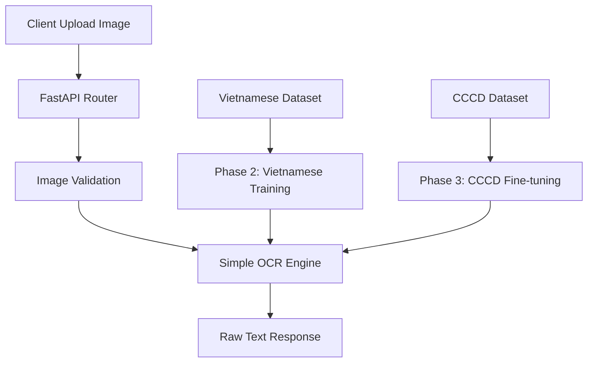

# ID Card Service - Project Architecture & Development Plan

## Tổng Quan Dự Án

**Mục tiêu**: Xây dựng REST API service để trích xuất thông tin từ thẻ căn cước công dân (CCCD) sử dụng PaddleOCR với phương pháp training từng bước.

**Roadmap thực tế**:
1. **Phase 1**: Tích hợp PaddleOCR cơ bản với English model
2. **Phase 2**: Training với Vietnamese OCR dataset (khi có)
3. **Phase 3**: Fine-tuning với CCCD dataset (khi có)
4. **Phase 4**: Production deployment

## Technology Stack

- **Backend Framework**: FastAPI + Uvicorn
- **OCR Engine**: PaddleOCR (CPU optimized)
- **Image Processing**: OpenCV + Pillow
- **Training**: PaddleOCR training tools (Phase 2+)
- **Data Validation**: Pydantic models
- **Package Management**: PDM

## Architecture Overview Đơn Giản



## Cấu Trúc Thư Mục Thực Tế

```
id-card-service/
├── src/id_card_service/
│   ├── api/
│   │   ├── __init__.py
│   │   ├── router.py          # API endpoints đơn giản
│   │   └── schemas.py         # Request/Response models
│   ├── core/
│   │   ├── __init__.py
│   │   ├── simple_ocr.py      # PaddleOCR wrapper đơn giản
│   │   └── image_utils.py     # Basic image processing
│   ├── training/              # Phase 2+ features
│   │   ├── __init__.py
│   │   ├── vietnamese_trainer.py    # Vietnamese OCR training
│   │   ├── cccd_trainer.py          # CCCD-specific training
│   │   └── data_augmentation.py     # Data augmentation tools
│   └── config/
│       ├── __init__.py
│       └── settings.py        # Simple settings
├── datasets/                  # Training datasets (Phase 2+)
│   ├── vietnamese_ocr/        # Vietnamese text dataset
│   └── cccd_samples/          # CCCD images dataset
├── models/                    # Trained models
│   ├── base/                  # Base PaddleOCR models
│   ├── vietnamese/            # Vietnamese trained models
│   └── cccd/                  # CCCD fine-tuned models
├── docs/                      # Documentation
├── tests/                     # Unit tests
├── pyproject.toml            # Dependencies
└── README.md                 # Project overview
```

## Development Phases Chi Tiết

### 🔧 Phase 1: Foundation (HIỆN TẠI)
**Mục tiêu**: Basic OCR service với English model

**Structure tối thiểu**:
```
src/id_card_service/
├── api/
│   ├── router.py              # Simple endpoints
│   └── schemas.py             # Basic models
├── core/
│   ├── simple_ocr.py          # PaddleOCR wrapper
│   └── image_utils.py         # Basic image handling
└── config/
    └── settings.py            # Basic config
```

**API Endpoints**:
- `POST /api/v1/test-ocr` - Upload image, get raw OCR text
- `GET /api/v1/health` - Health check
- `POST /api/v1/load-model` - Load PaddleOCR model

**Success Criteria**:
- ✅ PaddleOCR loads và extract text
- ✅ API trả về consistent JSON
- ✅ Service stable với basic images

### 📚 Phase 2: Vietnamese Training (KHI CÓ DATASET)
**Mục tiêu**: Train PaddleOCR cho tiếng Việt

**Thêm vào structure**:
```
src/id_card_service/
├── training/
│   ├── vietnamese_trainer.py  # Vietnamese OCR training
│   ├── data_preprocessor.py   # Dataset preprocessing
│   └── evaluation.py          # Model evaluation
└── datasets/
    └── vietnamese_ocr/        # Vietnamese text dataset
```

**New Features**:
- Vietnamese text recognition training
- Model evaluation metrics
- Training progress monitoring

### 🎯 Phase 3: CCCD Fine-tuning (KHI CÓ CCCD DATASET)
**Mục tiêu**: Fine-tune cho CCCD layout

**Thêm vào structure**:
```
src/id_card_service/
├── training/
│   ├── cccd_trainer.py        # CCCD-specific training
│   ├── field_extractor.py     # Extract CCCD fields
│   └── cccd_validator.py      # CCCD data validation
├── datasets/
│   └── cccd_samples/          # CCCD dataset
└── processors/                # CCCD-specific processing
    ├── text_cleaner.py        # Clean Vietnamese text
    ├── field_parser.py        # Parse CCCD fields
    └── validator.py           # Validate extracted data
```

**New Features**:
- CCCD field extraction (name, ID, date, etc.)
- Vietnamese text cleaning
- Data validation for CCCD format
- High accuracy for CCCD layout

### 🚀 Phase 4: Production Ready
**Mục tiêu**: Production deployment

**Additional Features**:
- Performance optimization
- Error handling
- Monitoring & logging
- Deployment scripts
- Documentation

## API Design Cho Từng Phase

### Phase 1 API (Hiện tại)
```json
POST /api/v1/test-ocr
Response: {
  "success": true,
  "texts": ["extracted text array"],
  "confidences": [0.8, 0.9, 0.7],
  "processing_time": 2.5
}
```

### Phase 2 API (Với Vietnamese model)
```json
POST /api/v1/extract-vietnamese
Response: {
  "success": true,
  "texts": ["improved Vietnamese text"],
  "model_version": "vietnamese-v1",
  "accuracy_score": 0.92
}
```

### Phase 3 API (Với CCCD extraction)
```json
POST /api/v1/extract-cccd
Response: {
  "success": true,
  "cccd_info": {
    "full_name": "NGUYỄN VĂN A",
    "id_number": "123456789012",
    "date_of_birth": "01/01/1990",
    "gender": "Nam"
  },
  "confidence_score": 0.89,
  "field_confidences": {...}
}
```

## Configuration cho Từng Phase

### Phase 1 Settings
```python
class Settings(BaseSettings):
    # Basic settings
    APP_NAME: str = "id-card-service"
    DEBUG: bool = False
    HOST: str = "0.0.0.0" 
    PORT: int = 5000
    
    # OCR settings
    OCR_LANG: str = "en"  # Start with English
    MAX_FILE_SIZE: int = 10 * 1024 * 1024
    SUPPORTED_FORMATS: List[str] = ["jpg", "jpeg", "png"]
```

### Phase 2+ Settings (Thêm vào)
```python
    # Training settings
    VIETNAMESE_MODEL_PATH: str = "./models/vietnamese/"
    TRAINING_DATA_PATH: str = "./datasets/vietnamese_ocr/"
    
    # CCCD settings (Phase 3)
    CCCD_MODEL_PATH: str = "./models/cccd/"
    CCCD_FIELDS: List[str] = ["name", "id", "dob", "gender", "address"]
```

## Dataset Requirements

### Phase 2: Vietnamese OCR Dataset
```
datasets/vietnamese_ocr/
├── images/                    # Vietnamese text images
├── annotations/               # Ground truth text
├── train.txt                  # Training list
├── val.txt                    # Validation list
└── README.md                  # Dataset description
```

### Phase 3: CCCD Dataset
```
datasets/cccd_samples/
├── front/                     # CCCD front images
├── back/                      # CCCD back images  
├── annotations/               # CCCD field annotations
├── train.txt                  # Training list
└── val.txt                    # Validation list
```

## Success Metrics cho Từng Phase

### Phase 1 Metrics
- ✅ Service uptime > 99%
- ✅ OCR processing < 10s per image
- ✅ English text accuracy > 70% (baseline)

### Phase 2 Metrics
- 🎯 Vietnamese text accuracy > 85%
- 🎯 Processing time < 8s per image
- 🎯 Model size < 500MB

### Phase 3 Metrics
- 🎯 CCCD field extraction accuracy > 90%
- 🎯 Name accuracy > 95%
- 🎯 ID number accuracy > 98%
- 🎯 Date accuracy > 95%

## Risk Management

### Phase 1 Risks
- **PaddleOCR compatibility**: ✅ Solved - using simple wrapper
- **English model limitations**: ⚠️ Expected - will improve in Phase 2

### Phase 2 Risks  
- **Dataset quality**: Need high-quality Vietnamese text images
- **Training time**: May require significant compute resources
- **Model size**: Balance accuracy vs deployment size

### Phase 3 Risks
- **CCCD variability**: Different CCCD formats/layouts
- **Small dataset**: May need data augmentation
- **Overfitting**: Need proper validation split

## Current Status & Next Steps

### ✅ Completed (Phase 1)
- Basic project structure
- PaddleOCR integration
- Simple API endpoints
- Health monitoring

### 📋 Ready for Phase 2 (Khi có Vietnamese dataset)
- Training infrastructure setup
- Model evaluation framework
- Vietnamese text preprocessing

### 📋 Ready for Phase 3 (Khi có CCCD dataset)
- CCCD field extraction logic
- Data validation rules
- Production optimization

---

*Document updated: December 6, 2025*  
*Version: 2.0 - Simplified Architecture*
*Current Phase: 1 - Foundation*